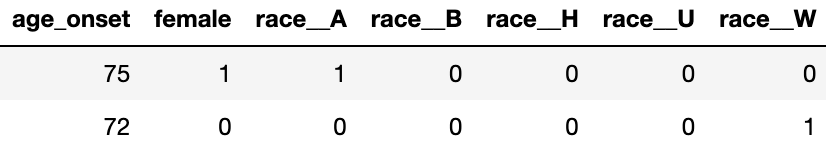
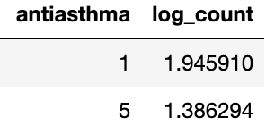
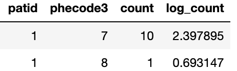

# Tutoria-paper-benchmark

## Introduction
The code respository are used for the benchmark experiments we presented in our reivew paper Emulate Randomized Clinical Trials using Heterogeneous Treatment Effect Estimation for Personalized Treatments: Methodology Review and Benchmark. 
- metalearner_benchmark.ipynb is the original jupyter notebook that records the original results for the experiments. 
- causal_forest_benchmark.ipynb records the benchmark experiments' results for the tree-based method mentioned in our paper. 
- representation_learner.py contains the represntation learning algorithm test in our benchmark experiments.
- representation_learning_benchmark.ipynb shows the results of our benchmark experiments for the representation learning.

## Data access
For the Benchmark Experiments, we used the OPTUM Health Claim Data Mart. Due to the policy, we cannot attach the source data here. One need to generate 3 pkl files to run our codes: YTXW_train.pkl, YTXW_test.pkl, YTXW_val.pkl. Each file contains 3 dataframes: X, T, W, and 1 numpy array Y. 
Here are some examples show what the data looks like:

X:

T:

W:

And Y is a binary numpy array (0, 1).

## Reference
Ling, Y., Upadhyaya, P., Chen, L., Jiang, X., & Kim, Y. (2022). Emulate randomized clinical trials using heterogeneous treatment effect estimation for personalized treatments: Methodology review and benchmark. Journal of biomedical informatics, 137, 104256. Advance online publication. https://doi.org/10.1016/j.jbi.2022.104256

